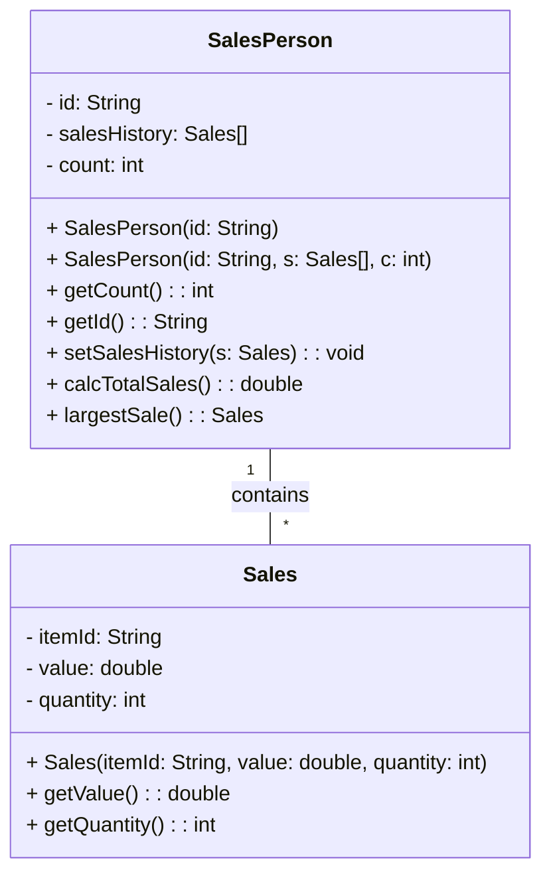

# OOP-forum-week-9
## Micky Malvino Kusandiwinata 2602174522
## Class L2CC
Forum Activity: Class Design and Implementation Case
To do:

1. Give answers to what is being asked for.

2. Implement the SalesPerson and Sales class, in addition, create a Driver class to simulate and test the validity of your code.

3. Upload all answers in your GitHub repo and share it as your reply to this thread.

=================================================================================================================================

### A large company with locations in different cities has taken an OOP approach in creating an administration program that manages all aspects of its business. These aspects include:

·the sale of all the different products that the company manages

·the salaries for managers, office staff and sales personnel.

 

#### 1.(a) By making use of an example from the above scenario, distinguish between a class and an instantiation of a class. (3 points)


>A: A class is the blueprint for declaring and creating objects, while an instance is a virtual copy (but not a real copy) of the object. In the scenario given, a class can be the "Employee" class, which defines the properties and behaviors that all employees in the company share like name, salary, address, etc. An instantiation of the "Employee" class would be a specific object created from this class, such as "Larry" perhaps.** 

>What this means is that an instantiation is like an actual example of a blueprint that has been created. Just like a blueprint for a house shows the general design and layout, but doesn't exist as a physical building until it's constructed, a class is like a blueprint that defines the general properties and behaviors of an object, but doesn't exist as an actual object until it's instantiated.


### The different modules in the program each open a graphical user interface (GUI). Each GUI has a similar design but contains differences specific to each module.

#### (b) By giving two examples, explain how the principles of inheritance can be incorporated into the design of this administration program. (4 points)

> The creation of a Manager class that inherits from an Employee class. The Employee class can contain attributes and methods common to all employees, such as name, address, and salary, while the Manager class can add additional attributes and methods specific to managers, such as a list of employees they manage and a method to approve employee vacation requests.

> The creation of a CorporateSalesPerson class that inherits from the SalesPerson class. The SalesPerson class can contain attributes and methods common to all salespeople, such as ID and sales history, while the CorporateSalesPerson class can add additional attributes and methods specific to corporate salespeople, such as a list of clients they work with and a method to calculate commission based on the size of the corporate deal.

#### (c) Describe how the use of libraries can facilitate the development of programs like this company’s administration program. (3 points)

> * Faster development: By using pre-existing libraries, developers can save time and effort by not having to write everything from scratch. 
> * Access to expertise: Depending on the libraries used, the company may be able to benefit from the expertise of other developers and organizations. 
> * Improved reliability: Libraries are typically rigorously tested and maintained by their developers, which can increase the reliability and stability of the administration program. 
> * Reduced costs: Using libraries can be a cost-effective solution for the company, as it eliminates the need to pay for additional development time or external resources.


#### 2. The company employs several sales personnel to sell its products to different retailers. Each branch of the company keeps track of its own sales with a suite of programs that include the two classes SalesPerson and Sales.

 
```java
public class SalesPerson {

// each object contains details of one salesperson

private String id;

private Sales[] salesHistory; // details of the different sales

private int count = 0; // number of sales made


//constructor for a new salesperson

public SalesPerson(String id){

// code missing

}

 

// constructor for a salesperson transferred (together with their sales details) from another branch

public SalesPerson(String id, Sales[] s, int c){

// code missing

}

 

public int getCount(){return count;}

public String getId() {return id;}

public void setSalesHistory(Sales s){

salesHistory[count] = s;

count = count +1;

}

 

public double calcTotalSales(){

// calculates total sales for the salesperson

// code missing

}

 

public Sales largestSale(){

// calculates the sale with the largest value

// code missing

}

}
```
 

#### Each instance variable is initialized when a SalesPerson object is instantiated.

#### (a) Complete the constructor public SalesPerson(String id), from the SalesPerson class. (2 points)

```java
public SalesPerson(String id){
this.id = id;
this.salesHistory = new Sales[100]; // Initialize array for sales history up to 100 sales
}
```

> This constructor initializes the id attribute with the value passed as a parameter, and initializes the salesHistory array with a length of 100

#### (b) Explain why accessor methods are necessary for the SalesPerson class. (3 points)

> Accessor methods are necessary for the SalesPerson class because the instance variables of the class are private, which means they cannot be accessed directly from outside the class. Accessor methods, such as getCount() and getSalesHistory(), provide a way for other classes to retrieve the values of these variables indirectly, without violating the principle of encapsulation.

 
```java
public class Sales {

// each object contains details of one sale

private String itemId;     // id of the item

private double value;      // the price of one item

private int quantity;      // the number of the items sold

// constructor missing

public double getValue() {return value;}

public int getQuantity() {return quantity;}

}
```
 

#### (c) (i) Construct unified modelling language (UML) diagrams to clearly show the relationship between the SalesPerson and Sales classes.
#### Note: There is no need to include mutator or accessor methods or a constructor. (4 points)



#### (c) (ii) Outline a negative effect that a future change in the design of the Sales object might have on this suite of programs. (2 points)

> A negative effect that a future change in the design of the Sales object might have on this suite of programs is that it could break the code that depends on the Sales class. For example, if the Sales object is changed to include additional attributes or methods, any code that accesses the Sales object directly (such as the setSalesHistory() method in the SalesPerson class) might no longer work correctly. This could require significant changes to the program to fix.


#### The company employs several sales personnel. The different salesPerson objects are held in the array salesPeople. The Driver class contains various methods that operate on the SalesPerson and Sales classes. The Driver class contains the following code:

```java
public static void main(String[] args){

SalesPerson[] salesPeople = new SalesPerson[6];

salesPeople[0] = new SalesPerson("100");

salesPeople[1] = new SalesPerson("101");

salesPeople[2] = new SalesPerson("102");

salesPeople[0].setSalesHistory(new Sales("A100",300.00,10));

salesPeople[0].setSalesHistory(new Sales("A200",1000.00,2));

salesPeople[1].setSalesHistory(new Sales("A300",2550.40,10));

System.out.println(salesPeople[2].getId());

System.out.println(salesPeople[0].getCount());

System.out.println(salesPeople[1].getSalesHistory(0).getValue());

System.out.println(salesPeople[0].calcTotalSales());

 }
 ```

#### (d) State the output after running this code. (4 points)

```
102
2
2550.4
5000.0
```

#### (e) Construct the method calcTotalSales(), in the SalesPerson class that calculates the total value of the sales for a specific SalesPerson object. (5 points)

```java
public double calcTotalSales() {
    double totalSales = 0.0;
    for (int i = 0; i < count; i++) {
        totalSales += salesHistory[i].getValue() * salesHistory[i].getQuantity();
    }
    return totalSales;
}

```
 

#### The salesPeople array contains 100 instantiated objects. The company wishes to reward the salesperson whose sales have the largest total value.

#### (f) By making use of any previously written methods, construct the method highest(), that returns the ID of the salesperson whose sales have the largest total value. (5 points)

```java
public static String highest(SalesPerson[] salesPeople) {
    String id = "";
    double highestSales = 0.0;
    for (SalesPerson salesPerson : salesPeople) {
        double sales = salesPerson.calcTotalSales();
        if (sales > highestSales) {
            highestSales = sales;
            id = salesPerson.getId();
        }
    }
    return id;
}

```

#### (g) Construct the method addSales(Sales s, String id), in the Driver class, that will add a new Sales object s, to the salesperson with a specified ID.

#### Note: You can assume that the ID is a valid one. (4 points)

```java
public static void addSales(Sales s, String id, SalesPerson[] salesPeople) {
    for (SalesPerson salesPerson : salesPeople) {
        if (salesPerson.getId().equals(id)) {
            salesPerson.setSalesHistory(s);
            break;
        }
    }
}

```

 

#### A further class in this suite of programs is the Payroll class. This class is run at the end of each month to calculate each salesperson’s salary, which is based on the sales that have been made during that month.

#### (h) Suggest changes that must be made to the SalesPerson class and/or the Sales class to allow these calculations to be made. (3 points)

> To allow the calculation of a salesperson's salary based on the sales they have made during a month, the Sales class needs to be modified to include the date on which the sale was made. The SalesPerson class also needs to be modified to keep track of the sales made during a specific month, and not just the total sales made so far.


####  (i) Discuss the use of polymorphism that occurs in this suite of programs. (3 points)

> Polymorphism occurs in this suite of programs in the form of method overriding. For example, the SalesPerson class has a method called calcTotalSales() that calculates the total sales for a salesperson, while the Payroll class also has a method called calcTotalSales() that calculates the total sales for a salesperson, but for the purpose of calculating their salary. The two methods have different implementations, but share the same name and signature, allowing them to be used interchangeably in the program.
